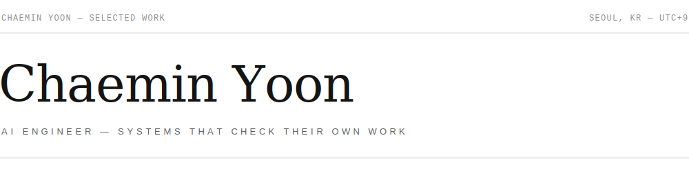

<picture>
  <source media="(prefers-color-scheme: dark)" srcset="assets/banner-dark.svg">
  
</picture>

I build AI systems that are accountable for their own output — document parsers that evaluate and repair their own failures, forecasting models measured on what production actually cares about, and retrieval pipelines instrumented for measurement before they are tuned for demos.

Three years in, I'm driving my company's AI transformation — which means owning document AI, spatio-temporal forecasting, and retrieval as one connected stack rather than three separate problems. The repositories below are that stack built end to end, from raw data to serving and monitoring, each with its own evaluation loop.

 

## Selected work

### 01 · Self-healing document parsing

**[Parse-Everything](https://github.com/chaeminyoon/Parse-Everything)** — Most parsing pipelines fail silently: garbage goes in a database and nobody notices until a user does. This workflow treats every parse as a hypothesis: outputs are scored against a quality gate, repairs are routed by cost (free heuristics → LLM text repair → vision table reconstruction), and any repair that lowers the score is rolled back. On real Korean environmental-assessment PDFs it recovers a document with half its body text missing from **0.41 to 0.93** on the quality score, and averages **0.73 in a five-engine head-to-head** where the best baseline reaches 0.67.

Python · LangGraph · PyMuPDF · Surya OCR · vision LLM repair · LangSmith · CI

### 02 · Operating a forecasting model like a service

**[AIS-Traffic-Ops](https://github.com/chaeminyoon/AIS-Traffic-Ops)** — The operations half of a maritime traffic forecasting system: **sixteen model versions** tracked in a registry, promotion via a `production` symlink, hot-reload deployment with zero server restarts, and FastAPI serving monitored through Prometheus and Grafana. Cross-version ranking uses actual-grid metrics rather than training loss — the loss function changed between experiments, so loss can't rank them. Training a model is the easy part; this repository is everything after.

Python · FastAPI · MLflow · Prometheus · Grafana · Docker

### 03 · Interpretable maritime risk forecasting

**[AIS-Traffic-Model](https://github.com/chaeminyoon/AIS-Traffic-Model)** — Short-term traffic forecasting on a 66×66 AIS grid: twelve 5-minute frames in, the next traffic map out. Sixteen documented versions trace the path from a ConvLSTM baseline to a gated spatial U-Net that holds production at **336K parameters** — occupancy F1 **3.3× (0.17 → 0.55)**, SSIM **+40%**, R² **0.05 → 0.50** over the baseline. All of it measured on actual traffic grids after inverse transform, because a model can reduce loss while still putting ships in the wrong cells.

TensorFlow · ConvLSTM → gated spatial U-Net · actual-grid evaluation · model registry

### 04 · Retrieval for questions vector search can't answer

**[Maritime-GraphRAG](https://github.com/chaeminyoon/Maritime-GraphRAG)** — Vector search retrieves what is *similar*; multi-hop questions need what is *related*. This engine builds a two-layer Neo4j graph (documents + typed maritime entities) and routes each question to the retriever that can answer it. A ground-truth benchmark shows why: vector search collapses on 2-hop questions (strict accuracy **0.91 → 0.38**), while direct graph querying reaches **0.85 overall vs 0.70 for vector** — and because no single retriever dominates, an agentic router picks the strategy per question. The same graph mines cross-document causal chains from **139 real KMST casualty adjudications**.

Neo4j · FastAPI · React · Text2Cypher · agentic retriever routing · ground-truth multi-hop benchmark

### 05 · Fixing RAG where it actually breaks: the data

**[RAG-Audit-Pipeline](https://github.com/chaeminyoon/RAG-Audit-Pipeline)** — Degraded retrieval is usually blamed on the model; more often the culprit is duplicates, near-answer distractors, and cleaning that deletes the answers themselves. This tool turns each into a measurable problem: two-stage deduplication (MinHash/LSH → embedding verification) at **0.90 precision / 1.00 recall**, per-query attribution of which documents push answers out of the top-k, and automatic failure classification grounded in the CAIN'24 / SIGIR'24 failure taxonomies. Every repair is verified by an 8-cell before/after ablation with bootstrap confidence intervals — local-first, no API keys, 76 tests.

Python · MinHash/LSH · BM25 + dense hybrid (RRF) · reranking · bootstrap ablation benchmark · pytest

### 06 · A document-to-vector pipeline that ships to air-gapped servers

**[Doc-Vectorize-Pipeline](https://github.com/chaeminyoon/Doc-Vectorize-Pipeline)** — The ingestion side of document retrieval, built for **~14 years of Korean government permit records** and a deployment target with no internet and no pip. ODT parsing keeps tables whole through chunking, BGE-M3 embeddings land in PostgreSQL/pgvector, and search switches itself from vector to hybrid when a company name appears in the query. Nine permit fields are extracted by rules with a confidence score, guarded by **~60 adversarial test cases** against false positives; ingestion is incremental by SHA-256, so re-runs touch only what changed. Results mirror into a partner's plain PostgreSQL — and the sync is *tested* to never create or drop the one table it doesn't own. The README demos every stage with captures from real runs, down to the rows and vectors that land in each table.

Python · lxml · BGE-M3 · PostgreSQL + pgvector · SQLAlchemy · Docker (air-gapped bundle) · rule-based field extraction

### 07 · Vehicle trajectory anomaly detection from road CCTV

**[Vehicle-Anomaly-Algorithm](https://github.com/chaeminyoon/Vehicle-Anomaly-Algorithm)** — Detecting wrong-way driving, lane-crossing, and sudden stops from CCTV vehicle tracks. Ten documented experiments evolve the baseline (LSTM autoencoder reconstruction error, **F1 0.25**) into a lane-relative rule-scoring pipeline fused with the autoencoder it replaced, at **F1 0.85** — the decisive moves were a 2D direction field learned from normal traffic, a `cross_flow` feature that counts lanes crossed immune to road curvature, and a hybrid score that lets the AE recover the oscillatory anomalies rules miss. Along the way: three rejected perspective-rectification attempts and one retracted claim, caught by enlarging the evaluation set — a benchmark with six samples per cell cannot tell improvement from noise.

YOLOv8 tracking · lane-relative features · 2D direction field · synthetic anomaly benchmark · LSTM autoencoder

> **🎓 Master's thesis** — *A Study on Improving the Accuracy of Vehicle Anomalous Trajectory Identification Using an LSTM Autoencoder* (석사학위논문)

 

## How I work

**Evaluation is the product.** A model without a measurement harness is a demo. Every system above ships with its own evaluation loop — quality gates, retrieval metrics, or operational thresholds — before it ships features.

**Explainability is an interface, not a report.** Attention maps, repair logs, and citations exist so that the person operating the system can decide when to trust it and when to override it.

**Reproducibility is table stakes.** Config-driven experiments, versioned data, and pipelines that resume instead of restart. If a result can't be reproduced, it didn't happen.

 

## Stack

| | |
|:--|:--|
| **Languages** | Python · SQL · TypeScript |
| **Modelling** | PyTorch · TensorFlow · scikit-learn |
| **LLM systems** | LangGraph · Ollama · Neo4j · ChromaDB · Langfuse |
| **Operations** | FastAPI · Docker · MLflow · DVC · MinIO |

 

---

Seoul, KR (UTC+9) — open to AI engineering roles in Canada · <a href="https://www.linkedin.com/in/chaemin-yoon-0a35782b7/">LinkedIn</a> · <a href="mailto:dbscoals789@gmail.com">dbscoals789@gmail.com</a>

No badges, no stat widgets. The repositories above are the résumé.
